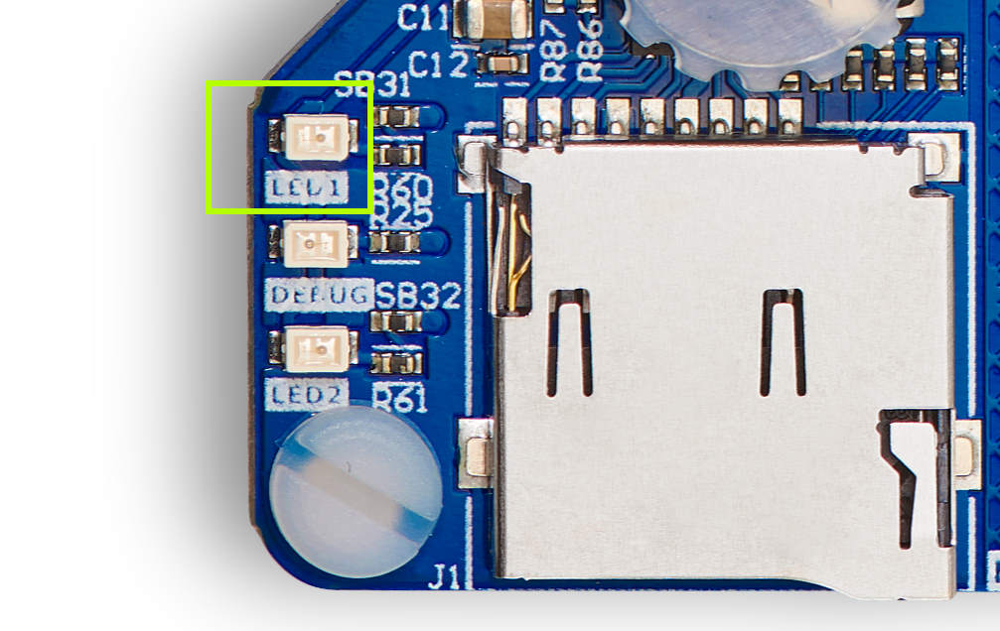
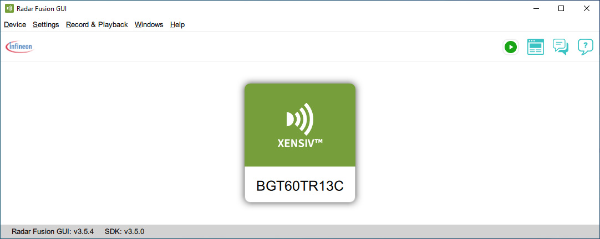
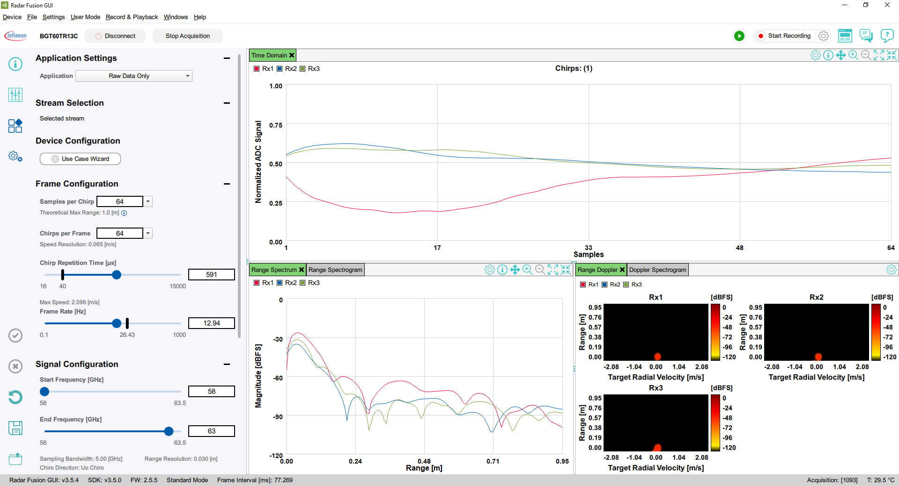

# RDK2 RAB3 Radar Fusion GUI Application

This ModusToolbox application enables the [RDK2](https://github.com/RutronikSystemSolutions/RDK2_Documents) development kit and [RAB3-Radar](https://github.com/RutronikSystemSolutions/RAB3_Radar_Hardware_Files) adapter board to be used with [Infineon Radar Fusion GUI](https://softwaretools.infineon.com/tools/com.ifx.tb.tool.radarfusiongui). 

 

Radar Fusion GUI detects only the BGT60TR13C part of the RAB3-Radar adapter board. The NJR4652F2 module is disabled and not used in this application.

## Requirements

- [ModusToolbox® software](https://www.infineon.com/cms/en/design-support/tools/sdk/modustoolbox-software/) **v2025.4.0** [built with **v3.1**]
- [Radar Fusion GUI](https://softwaretools.infineon.com/tools/com.ifx.tb.tool.radarfusiongui) [tested with **v3.5.4**]
- [RAB3-Radar Rev.1](https://github.com/RutronikSystemSolutions/RAB3_Radar_Hardware_Files) [official first release] Rutronik Adapter Board
- [RDK2](https://github.com/RutronikSystemSolutions/RDK2_Documents) Rutronik Development Kit

## Supported toolchains (make variable 'TOOLCHAIN')

- GNU Arm&reg; Embedded Compiler v11.3.1 (`GCC_ARM`) - Default value of `TOOLCHAIN`

## Using the code example

Create the project and open it using one of the following:

<b>In Eclipse IDE for ModusToolbox&trade; software</b>

1. Click the **New Application** link in the **Quick Panel** (or, use **File** > **New** > **ModusToolbox&trade; Application**). This launches the [Project Creator](https://www.infineon.com/ModusToolboxProjectCreator) tool.

2. Pick a RDK2 kit from the list shown in the **Project Creator - Choose Board Support Package (BSP)** dialog.

   When you select a RDK2, the example is reconfigured automatically to work with the kit. To work with a different supported kit later, use the [Library Manager](https://www.infineon.com/ModusToolboxLibraryManager) to choose the BSP for the RDK2. You can use the Library Manager to select or update the BSP and firmware libraries used in this application. To access the Library Manager, click the link from the **Quick Panel**.

   You can also just start the application creation process again and select a different kit.

   If you want to use the application for a kit not listed here, you may need to update the source files. If the kit does not have the required resources, the application may not work.

3. In the **Project Creator - Select Application** dialog, choose the RDK2_RAB3_Radar_Fusion example by enabling the checkbox.

4. (Optional) Change the suggested **New Application Name**.

5. The **Application(s) Root Path** defaults to the Eclipse workspace which is usually the desired location for the application. If you want to store the application in a different location, you can change the *Application(s) Root Path* value. Applications that share libraries should be in the same root path.

6. Click **Create** to complete the application creation process.

For more details, see the [Eclipse IDE for ModusToolbox&trade; software user guide](https://www.infineon.com/MTBEclipseIDEUserGuide) (locally available at *{ModusToolbox&trade; software install directory}/docs_{version}/mt_ide_user_guide.pdf*).

### Operation

After the firmware has been programmed to the RDK2 microcontroller successfully, it may be used with the Infineon Radar Fusion GUI without any further adjustments. Simply connect RDK2’s USB-C port to your PC and see if the GREEN LED1 is blinking. This means that RDK2 is in idle mode and it is ready for operation.

- Start your Radar Fusion GUI and click on detected sensor BGT60TR13C. 

  

- Operate the Radar Fusion GUI as you would normally do with an [IRadar Baseboard MCU 7](https://www.infineon.com/dgdl/Infineon-AN599_Radar_Baseboard_MCU7-ApplicationNotes-v02_70-EN.pdf?fileId=5546d4627550f45401755594a51a4d27). 

  

**NOTICE:** Please keep in mind that due to the RDK2 SPI and USBFS hardware limitations, the data transfers are slower than with IRadar Baseboard MCU7. Try to keep lower data rate as possible by only analyzing the necessary signal, keeping the *Frame Rate*, *Samples per Chirp*, and *Chirps per Frame* at a minimum.

## Legal Disclaimer

The evaluation board including the software is for testing purposes only and, because it has limited functions and limited resilience, is not suitable for permanent use under real conditions. If the evaluation board is nevertheless used under real conditions, this is done at one’s responsibility; any liability of Rutronik is insofar excluded. 

